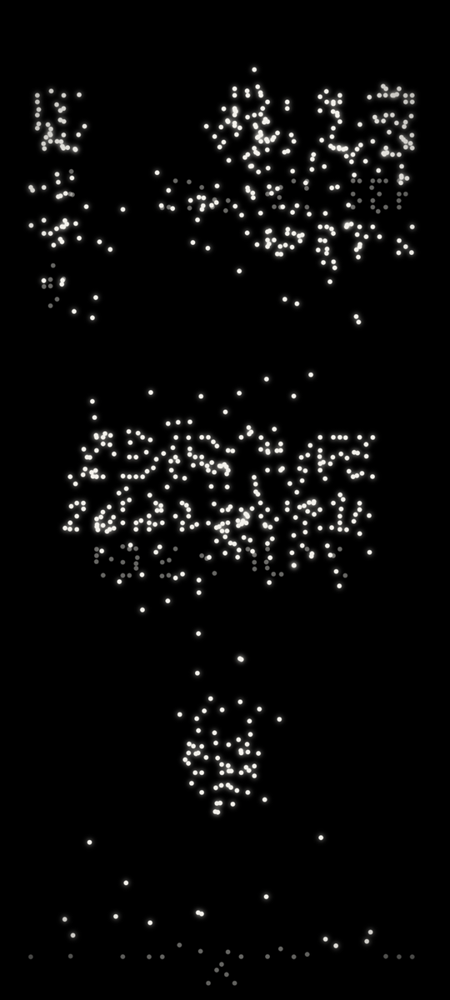
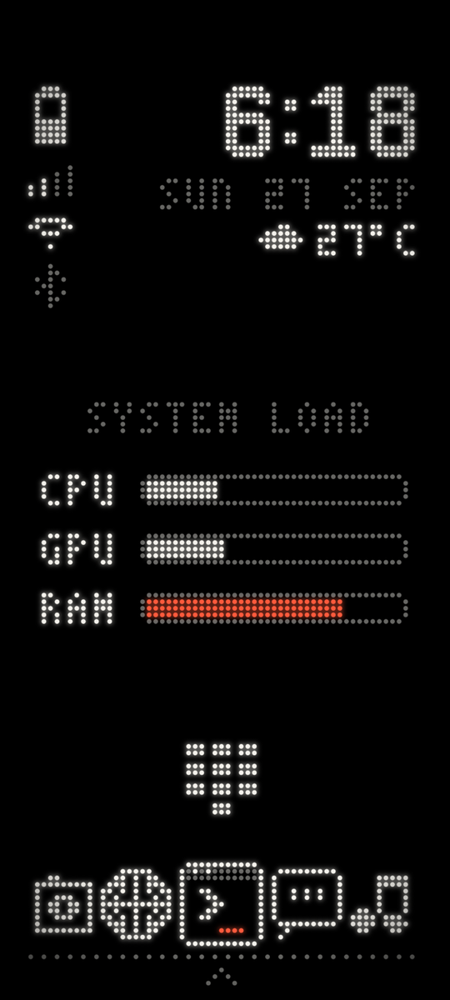
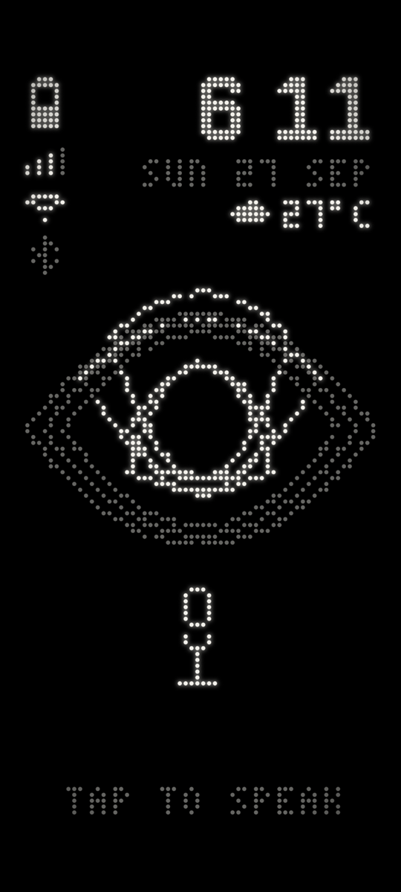
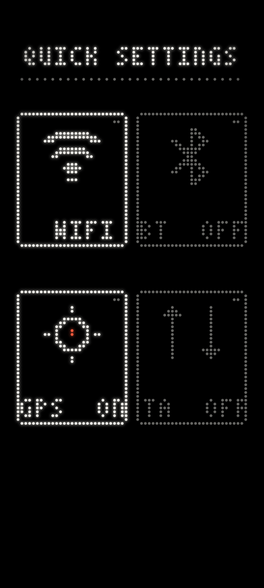

<p align="center">
  
</p>

<p align="center"><b>A home screen made of dots.</b></p>

<br>

ZrnDotMatrix is an Android launcher that draws everything on a single grid of round LED dots. The clock, the battery, the song that's playing, your apps: all of it is lit dots on black, and nothing else. There's no wallpaper and no icon grid.

When something changes, the dots fly to their new places. Unlock the phone and the whole home screen assembles itself. Open an app and the dots spell out its name.

It's deliberately small. Most of the time you're looking at one screen with very little on it.

<p align="center">
  
  
  
  
  
</p>

## What's in it

**The middle of the home screen changes with what you're doing.** Normally it shows system load. Plug in and it shows the charge. Play music and it becomes a live visualiser with transport controls. Connect to Wi-Fi or Bluetooth and it says so for a few seconds.

**The dock** holds a camera, a browser, Termux, a chat app and a music app. Swap any of them in settings. A tile blinks red when that app has a notification waiting.

**Waking up** replays the boot. The dots either rise out of a random scatter or pour out of the fingerprint sensor. The launcher reads the sensor's position from the system where it can, falls back to where a Pixel 7's sits, and lets you map it by hand.

**RIGEL**, one swipe to the left, is an assistant you talk to. It runs on your phone inside Termux, answers on the dot matrix, and can drive the phone for you: the torch, volume, the clipboard. Ask it for a new icon and it will draw one. Ask it for something the launcher can't do and it can write that too, like water that sloshes across the screen when you shake the phone.

**Quick settings** are one swipe to the right: Wi-Fi, Bluetooth, location and mobile data.

**Six colour palettes**, an AMOLED mode, adjustable haptics, and a settings page that keeps an undo history, so anything RIGEL changes can be rolled back.

It's also easy on the battery. The screen only redraws when something on it actually changes, which on an idle home screen is a couple of times a second.

## Getting around

| | |
|---|---|
| Swipe left | RIGEL |
| Swipe right | Quick settings |
| Tap the arrow at the bottom | App drawer |
| Hold anywhere on the home screen | Palettes and AMOLED mode |
| Hold the middle of the home screen | Talk to RIGEL without leaving home |
| Swipe up with three fingers | Settings |

## Install

Download `ZrnDotMatrix-release.apk` from the [latest release](https://github.com/z3r0n3br4instorm/ZrnDotMatrix/releases/latest), install it, press Home and pick ZrnDotMatrix. It runs on Android 5.0 and up.

Each build is currently signed with a fresh key, so to move to a newer build you need to uninstall the old one first.

### Setting up RIGEL

RIGEL needs [Termux](https://f-droid.org/packages/com.termux/) (from F-Droid or GitHub, not the Play Store) and permission to run commands in it:

1. In Termux, run:
   ```
   mkdir -p ~/.termux && echo "allow-external-apps = true" >> ~/.termux/termux.properties && termux-reload-settings
   ```
2. Allow ZrnDotMatrix's "Run commands in Termux environment" permission when it asks (or under App info → Permissions).
3. Swipe to RIGEL. The first time, it walks you through installing its backend inside Termux.

RIGEL runs on Google's [Antigravity CLI](https://antigravity.google/). It doesn't ship with this app: the setup downloads it onto your phone, and you use it under Google's terms. Support for [opencode](https://opencode.ai/) is still in development.

## Building it yourself

You need JDK 17 and the Android SDK.

```
./gradlew assembleDebug
adb install -r app/build/outputs/apk/debug/app-debug.apk
```

The interface is JavaScript in `app/src/main/assets/web/`, drawn with WebGL inside a WebView: every dot is a GPU point sprite. The Kotlin side in `app/src/main/java/lab/zerone/launcher/` supplies the apps, status, sensors, haptics and the link to Termux. RIGEL's scripts and skills live in `app/src/main/assets/rigel/`.

## Credits

- Weather from [Open-Meteo](https://open-meteo.com/), used under [CC BY 4.0](https://creativecommons.org/licenses/by/4.0/). Their free API is for non-commercial use.
- [Termux](https://termux.dev/) and Termux:API, which RIGEL runs inside. They're installed separately and aren't part of this app.
- On Termux, RIGEL installs Antigravity through the community port [wallentx/antigravity-cli-termux](https://github.com/wallentx/antigravity-cli-termux). That script comes from a third party and runs on your phone.

## License

Copyright © 2026 Ometh Abeyrathne, Zerone Laboratories.

ZrnDotMatrix is free software, released under the [GNU General Public License v3.0](LICENSE). You're free to use, study, change and share it. If you distribute a modified version, you have to release its source under the same license.

The GPL covers the code. It doesn't cover the ZERONE and ZrnDotMatrix names or the dot-matrix logos, which stay reserved. If you ship your own fork, please give it a different name and look.
